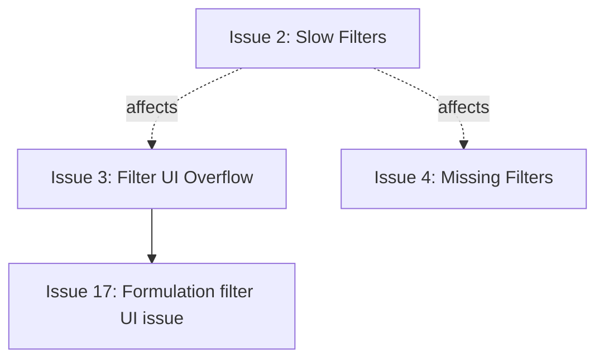

# Portfolio Dashboard Improvements vs JS

This document expands the [planning brief](.cursor/plans/portfolio_dashboard_improvements_b2191704.plan.md) into a written backlog maintained within `docs/overhaul`. Each issue is scoped so it can be addressed independently across multiple sessions, with references back to the relevant source files, business impact, and next steps.

---

## Status & Priority Legend

- **Statuses**: 🔴 Not started · 🟡 In progress · 🟢 Complete · ⚫ Blocked
- **Priority**: P0 (Critical) · P1 (High) · P2 (Medium) · P3 (Low)
- **Effort spectrum**: Short (1-3 hrs), Medium (3-6 hrs), Long (>6 hrs)

---

## Summary Dashboard

| Area | Issues | Critical | High | Medium | Low | Comments |
| --- | --- | --- | --- | --- | --- | --- |
| Financial Dashboard | 4 | 2 | 2 | 0 | 0 | Filters+performance focus |
| Formulations | 4 | 2 | 2 | 0 | 0 | Filtering + pagination + creation |
| Formulation Countries | 5 | 1 | 3 | 1 | 0 | Status/rationale + filters |
| Countries | 3 | 0 | 3 | 0 | 0 | Filter persistence + new ``Include in Financial Plan`` flag |
| Use Groups | 3 | 0 | 1 | 2 | 0 | Filter UI + counts + traceability |
| Business Cases | 4 | 1 | 0 | 2 | 1 | Version history, table clarity, exports, COGS |
| Cross-cutting | 3 | 0 | 2 | 1 | 0 | Filter perf, UI, pagination |

---

## Issue Breakdown

### Financial Dashboard (Analytics Page)

1. **Intermittent blank state on load** (P0 · Medium)
   - **Files**: `src/app/portfolio/analytics/page.tsx`
   - Shared default filters work everywhere except this tab, so formulation and country statuses often appear blank after landing. The page should hydrate the global filter state before rendering.
   - **Approach**: Add explicit loading states, wire this page into the shared filter store, and gate the initial render until the filters are ready.

2. **Slow filter interactions (10+ sec)** (P0 · Medium)
   - **Files**: `src/components/filters/GlobalFilterBar.tsx`, `src/hooks/use-portfolio-filters.ts`
   - Selecting filters recalculates huge data sets synchronously, creating the appearance that the controls are broken.
   - **Approach**: Introduce debounced handlers, memoized option computations, and visual feedback (skeleton/loading) during heavy recalculations.

3. **Formulation filter UI overflow** (P1 · Short)
   - **Files**: `GlobalFilterBar`, `src/components/ui/multi-select.tsx`
   - Unlike the country filter, long formulation selections never collapse, obstructing other filters.
   - **Approach**: Collapse to an "X selected" pill once the chip list exceeds a threshold, mirroring the country control.

4. **Missing filters (Financial Plan status / Use Group status)** (P2 · Medium)
   - **Files**: `use-portfolio-filters.ts`, `GlobalFilterBar`
   - The relevant filter is the explicitly labeled “Use Group status,” not “Use Group active.”
   - **Approach**: Surface both new filters inside the bar, load options through the cascading system, and persist them in the shared store.

### Formulations Page

5. **Filter always reverts to Azoxystrobin 250 / pagination broken** (P0 · Medium)
   - **Files**: `src/app/portfolio/formulations/FormulationsClient.tsx`, `FormulationsPageContent.tsx`
   - Top-level portfolio filters should drive the list, but default selections still surface statuses like Killed/Not Yet Evaluated, pagination stalls at “1 of 42,” and selecting any formulation collapses the view to Azoxystrobin 250.
   - **Approach**: Honor top-level formulation/country/status selections, remove the Azoxystrobin default, and fix pagination to iterate through the filtered total.

6. **Unable to create or update formulations** (P0 · Medium)
   - **Files**: server routes + validation logic
   - Creating/updating currently errors out even with required fields completed.
   - **Approach**: Trace payloads, align with Supabase validation, and surface actionable errors.

7. **Record cap at 100 formulations** (P1 · Medium)
   - **Files**: `FormulationsClient`, progressive loading helpers
   - The list stops at 100 rows even with no filters.
   - **Approach**: Revisit query limits, support pagination/batching, and display total counts.

8. **Status filters return random results** (P1 · Medium)
   - **Files**: `FormulationsClient` filtering
   - Selecting a formulation status yields unexpected rows.
   - **Approach**: Fix the cascaded filtering logic and add regression tests for typical combinations.

### Formulation Countries

9. **Country status edits need rationale + cleaner labels** (P1 · Medium)
   - **Files**: `[id]/page.tsx`, `FormulationCountryEditModal.tsx`
   - Hide readiness/readiness notes, move status rationale to the top, and rename “EU approved?” to “Is this formulation approved for use in this country?”. Rationale should be required for status changes.

10. **Registration details / “country entry active” toggle add noise** (P2 · Short)
    - **Files**: `[id]/page.tsx`
    - Remove the registration details block and undefined “country entry active” toggle until their process is formalized.

11. **Need ability to create formulation countries** (P0 · Medium)
    - **Files**: `formulation-countries/page.tsx`
    - No UI exists for creating a formulation-country record.
    - **Approach**: Add a "New formulation country" workflow that captures formulation, country, and status, reusing form components when possible.

12. **Filters default to Azoxystrobin & Albania** (P1 · Short)
    - **Files**: `formulation-countries/page.tsx`, `GlobalFilterBar`
    - Selections often snap to a single formulation/country without explanation, and choosing a country rarely filters the list.
    - **Approach**: Trace filter propagation, ensure selected combinations apply, and add UI cues about the active filters.

13. **“Selected for entry” filter ignores shared filters** (P1 · Short)
    - **Files**: `formulation-countries/page.tsx`, `use-portfolio-filters.ts`
    - The toggle does not honor the global filter selections.
    - **Approach**: Apply the top-level filters before showing this toggle so the view stays consistent across pages.

### Countries Page

14. **Formulation countries card totals do not match filtered metrics** (P1 · Medium)
    - **Files**: `countries/page.tsx`, `CountryFormulationsTable.tsx`
    - The main summary respects filters, but the formulation countries card underneath aggregates a different dataset.
    - **Approach**: Share the filtered dataset between the summary and card so totals align.

15. **Country drill-in loses filter persistence** (P1 · Medium)
    - **Files**: `countries/[id]/page.tsx`, `use-portfolio-filters.ts`
    - When drilling into a country (e.g., United States), the FY30 summary starts counting all business cases and ignores the filters applied on the parent page; overall filters also drop on the Countries/Financial Dashboard tabs.
    - **Approach**: Rehydrate and reapply shared filters before rendering drill-in views.

16. **“Include in Financial Plan” filter needed at country level** (P2 · Medium)
    - **Files**: `countries/page.tsx`, `use-portfolio-filters.ts`
    - No filter exists for whether formulation countries should be part of the financial plan.
    - **Approach**: Add a toggle to the global filters and expose the same field on the country summary/detail screens.

### Use Groups Page

17. **Formulation filter UI issue (shared with Financial Dashboard)** (P1 · Short)
    - **Files**: `use-groups/UseGroupsClient.tsx`, `GlobalFilterBar`
    - The formulation selection never collapses, obstructing the Use Group filter.
    - **Approach**: Apply the same collapse/summary fix used on the Financial Dashboard.

18. **Use group count clarity** (P2 · Medium)
    - **Files**: `UseGroupsList.tsx`
    - Counts duplicate use groups per country; stakeholders want to see both unique and total counts.
    - **Approach**: Display both figures (e.g., "12 unique / 24 country combinations").

19. **Target Market Entry traceability** (P3 · Medium)
    - **Files**: Use group edit modal, change logging utilities
    - Add rationale capture when Target Market Entry changes and log it for auditability (`docs/CHANGE_LOGGING.md`).

### Business Cases

20. **Version history needs deeper detail** (P1 · Medium)
    - **Files**: `BusinessCaseVersionHistory.tsx`
    - The tab today only shows metadata without the actual values or rationales for each entry.
    - **Approach**: Surface field-level changes and full change rationale (with diff highlighting) for every version.

21. **Truncated formulation names hurt readability** (P2 · Short)
    - **Files**: Business case list/table components
    - Formulation names are truncated in tables; stakeholders rely on recognizable reference product names.
    - **Approach**: Allow column resizing or text wrapping/popovers so names are visible without hover.

22. **CSV exports are hard to interpret** (P2 · Medium)
    - **Files**: `BusinessCaseImportModal.tsx`, export utilities
    - Exports currently show only formulation codes/use group variants and lack the FY staggered layout or volume/NSP rows.
    - **Approach**: Either reformat the CSVs to include friendly names, fiscal-year breakdowns, and volume/NSP rows or temporarily disable the CSV upload flow until a better format is defined.

23. **COGS tab & permissions need refinement** (P3 · Long)
    - **Files**: `portfolio/cogs/page.tsx`, permission utilities
    - The hidden COGS tab lacks a workflow, and there is no way to let leadership edit while country managers stay read-only.
    - **Approach**: Surface the tab, build the workflow, and add role-based permissions so only designated personas can edit.

## Cross-Cutting Concerns

- **Filter performance**: Debounce updates, memoize option calculations, and provide intermediate loading states wherever `GlobalFilterBar` is present.
- **Filter UI consistency**: Collapse long selections, standardize chip behavior, and reuse status dropdown components.
- **Pagination reliability**: Centralize pagination so every list honors total count, filtering, and page navigation.

---

## Implementation Guidelines

1. Read the linked components/hook files first.
2. Document current behavior and expectations in this file.
3. Work one fix at a time—small commits and testable chunks.
4. Update tests or capture manual QA steps.
5. Surface behavior changes for stakeholders (release notes or doc updates).

## Dependencies & Relationships

## Session Template

Before each work session, capture:
- **Session goal** (e.g., stabilize Financial Dashboard filters)
- **Issues targeted** (list of relevant IDs)
- **Success criteria** (screens, status changes, testing)
- **Testing plan** (manual steps or commands)
- **Notes** (blockers, follow-up work)

---

## File Placement

This improvement log lives at `docs/overhaul/portfolio_dashboards_improvements_vs_js.md`, keeping it alongside other operational documents such as `CHANGE_LOGGING.md` and `KPI_DASHBOARD_PERMISSIONS.md` for easy reference.
